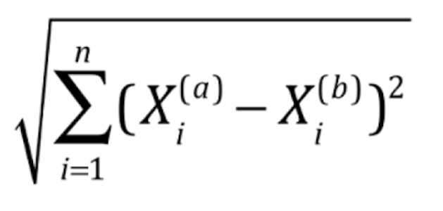
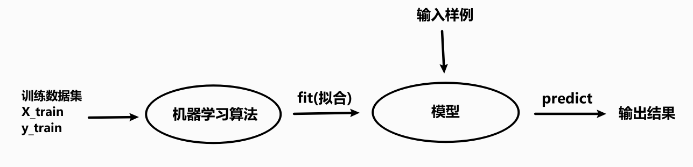
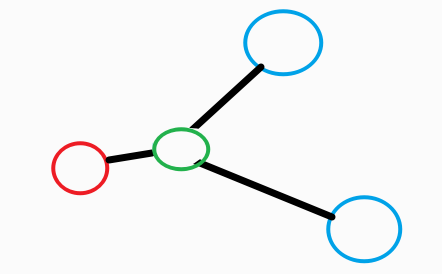
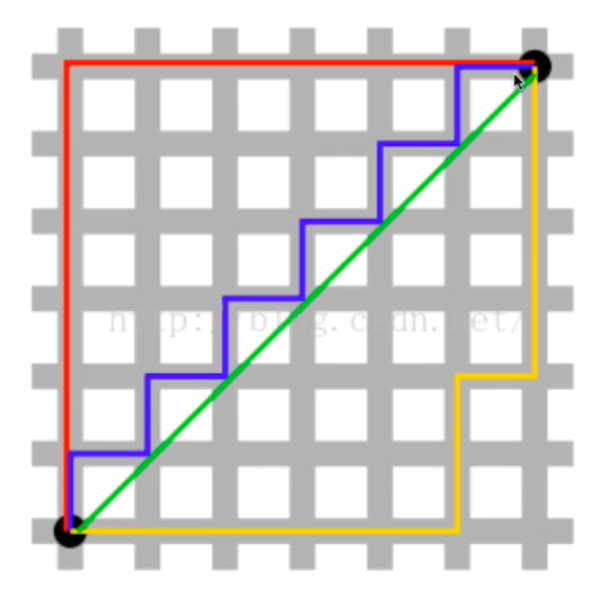
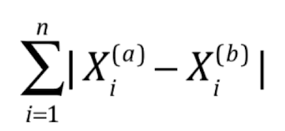
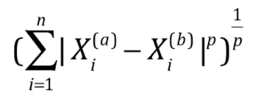
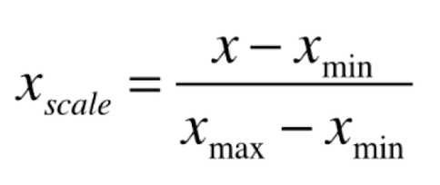
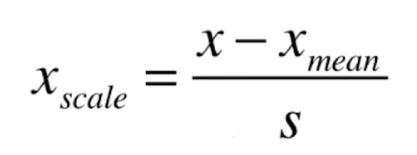
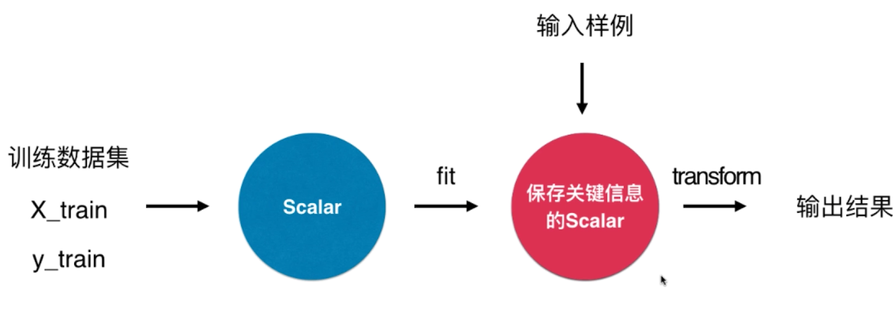
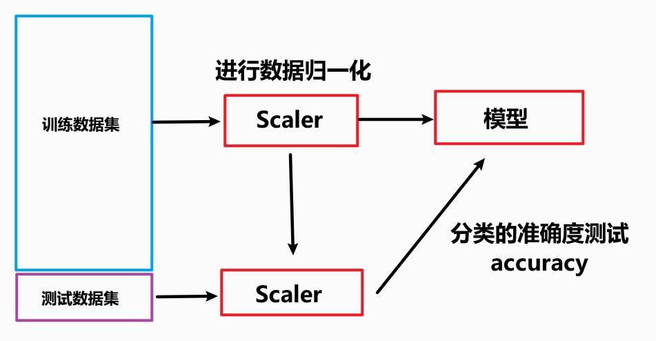

## KNN算法

*   解决分类问题，多分类问题
*   解决回归问题
*   缺点1：时间效率低下，每一个新的数据，需要O(m*n)
*   可以通过适用树结构进行优化
*   缺点2：高度数据相关
*   缺点3：预测的结果不具有可解释性
*   缺点4： 容易引发维数灾难，随着维度的增加，“看似相近”的两个点之间的距离越来越大

根据实际数据与现有数据的欧拉距离，找到与实际数据最相近的那些点，来确定实际数据的类别

欧拉距离





特点

*   没有模型的算法
*   可以将训练数据集就是模型本身




## 自己实现

通过机器学习库中 `sklearn.neighbors` 的 `KNeighborsClassifier` `knn`算法

```python
from sklearn.neighbors import KNeighborsClassifier
import numpy as np

# 训练数据    x代表坐标点   y代表类别
raw_data_X = [[3.393533211, 2.331273381],
              [3.110073483, 1.781539638],
              [1.343808831, 3.368360954],
              [3.582294042, 4.679179110],
              [2.280362439, 2.866990263],
              [7.423436942, 4.696522875],
              [5.745051997, 3.533989803],
              [9.172168622, 2.511101045],
              [7.792783481, 3.424088941],
              [7.939820817, 0.791637231]
             ]
raw_data_y = [0, 0, 0, 0, 0, 1, 1, 1, 1, 1]
# 实际数据  判断  x 数据点属于何种类别(x or y)
x = np.array([8.093607318, 3.365731514])

# 放到 numpy的数组中  x 为矩阵   y 为向量
X_train = np.array(raw_data_X)
y_train = np.array(raw_data_y)

# 与数据集距离最近的 n_neighbors=7 比较
kNN_classifier = KNeighborsClassifier(n_neighbors=7)
# 进行模型拟合
kNN_classifier.fit(X_train, y_train)
# 对样本进行处理
X_predict = x.reshape(1, -1)
# 进行样本预测
y_predict = kNN_classifier.predict(X_predict)
print(y_predict[0])
```


## KNN的性能

>   测试现有的数据集生成的模型的准确度，效率
>
>   改进算法

**train_test_split**

将数据集分成两部分：训练集，测试集

进行分类判断


## 超参数

KNN中决定样本数据与**K**个训练数据进行距离比较    

其中的 K 就是超参数

*   超参数：在算法运行前需要决定的参数
*   模型参数： 算法过程中学习的参数

KNN算法没有模型参数

KNN算法中的 K 是典型的超参数

**调参就是在调整参数**


### 寻找最好的K

通过改变 K值 观察不同的准确性，确定K 的最佳取值


## 改进现有的KNN算法

将距离也作为考虑因素

考虑如下一种情况：



此时样本绿色圈与红色圈的距离较两个蓝色圈更近，但之前的KNN算法来判断，蓝色数量更多，将样本判断为蓝色类别，这明显是不合理的

或者说：当与样本距离最近的几个点中，各个类别所占比例是相等的，之前的KNN算法只能随机选择一个作为样本的判断类别，这明显是不合理的


优化思路：

将距离也考虑进来，将**距离的倒数**作为比较的一个因素


## 有关距离

*   绿色直线是欧拉距离
*   红线，黄线是曼哈顿距离




欧拉距离


曼哈顿距离




将两者总结归纳为

**明可夫斯基距离**

p=1 为曼哈顿

p=1/2 为欧拉距离




此时，对于KNN算法距离的计算，我们有了两种方法，但哪种方法更优，关系到P 的取值

所以，要对于这个**超参数 P** 进行讨论比较


### 更多的距离定义

相似度

*   向量空间余弦相似度 `Cosine Similarity`
*   调整余玄相似度  `Adjusted Cosine Similarity`
*   皮尔森相关系数  `Pearson Correlation Coefficient`
*   Jaccard 相似系数 `Jaccard Coefficient`


## 网格搜索

`Grid Search` 


## 数据归一化

不同特征之间的量纲不同，导致量纲大的特征值被小的所主导，例如：

|       | 肿瘤大小（厘米） | 发现时间（天） |
| ----- | ---------------- | -------------- |
| 样本1 | 1                | 200            |
| 样本2 | 5                | 100            |

即使样本1的肿瘤大小特征比样本2的小了5倍之多，而发现时间只大了两倍

但因为没有选取最佳的量纲，导致样本1，2之间的特征距离主要由发现时间所决定，影响了对样本的判断


解决方案：**将所有的数据映射到同一尺度**

其中一种方法是

### 最值归一化 `Normalization`

>   适用于分布有明显边界的情况：受极值的影响比较大

将数据归一到0-1之间

*   先求特征值中的最大值与最小值的差 `max - min`
*   用样本特征值减去最小值  `X - min`
*   再将两者做除法




### 均值方差归一化（优先考虑）

>   数据分布没有明显的边界，有可能存在极端数据值，**不受极值的限制**

把所有数据归一到均值为0 方差为 1 的分布中



```python
numpy.mean(numpyArray)  # 求数组的均值
numpy.std(numpyArray)   # 求数组的方差
```


## 对测试数据集进行归一化

`mean_train`

`std_train`

在进行拟合模型时，训练数据集进行归一化后

对于测试数据，进行归一化时，应该采用训练数据集的方差与均值

**`(X_test - mean_train) / std_train`**  

python中专门的库来应对这种情况，保存关键信息




## 机器学习流程

先使用网格搜索寻找最好的超参数




## 维数灾难

>   随着维度的增加，“看似相近”的两个点之间的距离越来越大

| 1维     | 0到1的距离                 | 1     |
| ------- | -------------------------- | ----- |
| 2维     | （0，0）到（1，1）的距离   | 1.414 |
| 3维     | （0，0）到（1，1）的距离   | 1.732 |
| 64维    | （0，0……0）到（1，1……1）   | 8     |
| 10000维 | （0，0，……0）到（1，1……1） | 100   |


解决方法：降维