---

---

# 线性回归法

**Linear Regression**       对于数据具有强解释性

* 解决线性回归问题（数据之间存在线性关系）

* 思想简单，实现容易

* 许多强大的非线性模型的基础

* 结果具有很好的可解释性

* 蕴含机器学习中的很多重要思想

## 简单线性回归

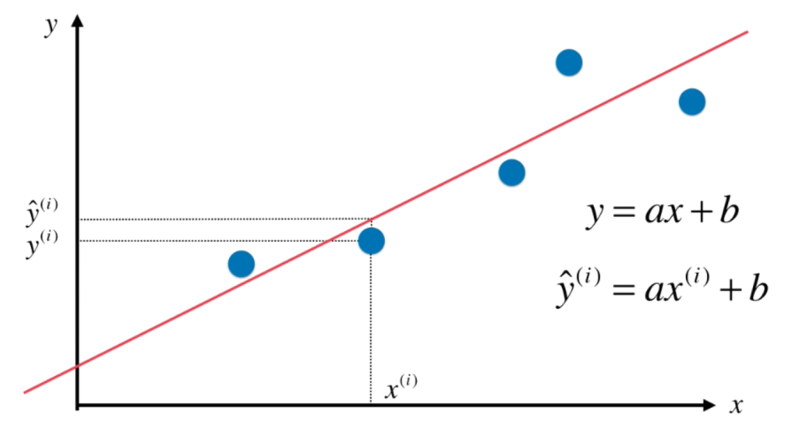

求出了最佳拟合的直线方程后，要使实际值y(i) 与 预测值y`(i)  差距尽量小

用（y(i) - y`(i))^2  表示两者的距离（处处可导）

也就是使所有样本的▲y 最小

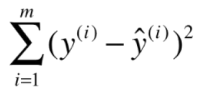

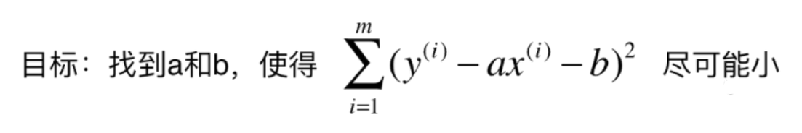

- **通过分析问题，确定问题是损失函数或者是效用函数**

- **通过最优它，获得机器学习的模型**

通过参数去优化函数，进而优化模型

## 向量化运算

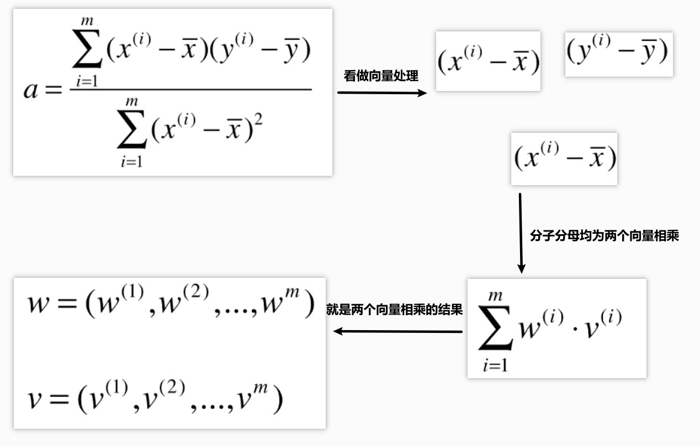

## 算法的评测

上面我们求出了决定算法准确度的表达式，表示 y_prediction  和  y_fact 之间的差距之和

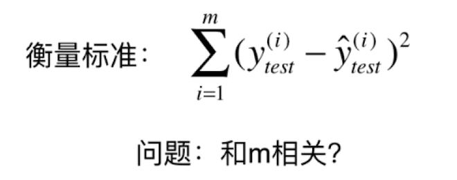

但有一个明显的缺陷是： 误差与数据集的数量m 是相关的

需要将这个因素消除掉

### 均方误差 MSE

均方误差会将较大的误差值放大（平方的缘故）

所以使均方误差越小，最大的误差也就越小

将其除以m    称为 均方误差 MSE


### 均方根误差RMSE

然后加上根号，让量纲统一    

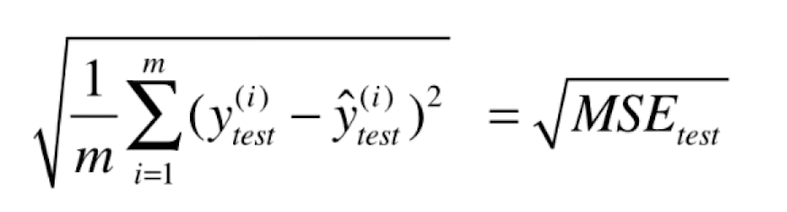

### 平均绝对误差

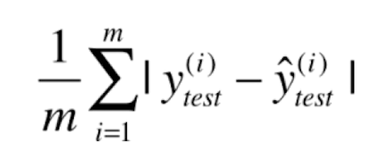

## 评价回归算法 R Square

对于不同标签的数据集，采用上面的MSE或是RSE，都无法反映不同标签之间的误差大小

而回归算法 R Square 更好的解决了这个问题

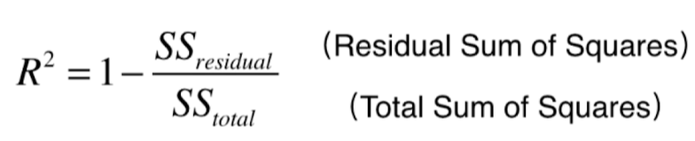

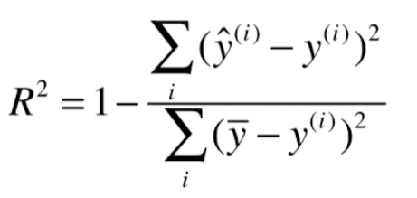

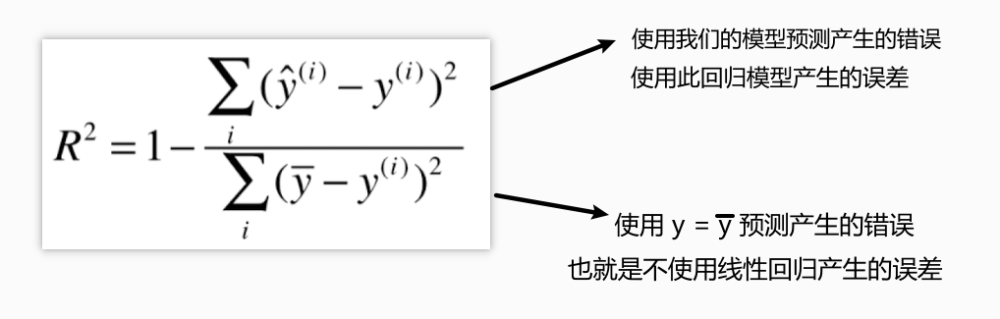

* R^2 <= 1
* R^2 越大越好  当预测模型不犯任何错误时，R^2 得到最大值1
* 当我们的模型等于基准模型时，R^2 为0
* 如果 R^2 < 0 说明模型还不如基准模型。很有可能我们的数据不存在任何线性关系

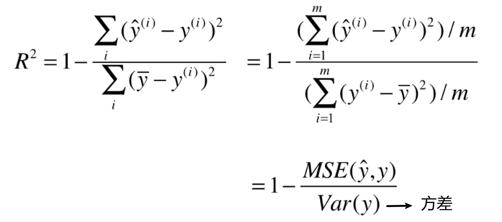

```python
R^2 = 1 - mean_squared_error(y_test, y_predict) / np.var(y_test)
# 调用模块中的方法
from playML.metrics import r2_score
r2_score(y_test, y_predict)
# 或者是
from sklearn.metrics import r2_score
r2_score(y_test, y_predict)
reg.score(x_test, y_test)
```

## 多元线性回归

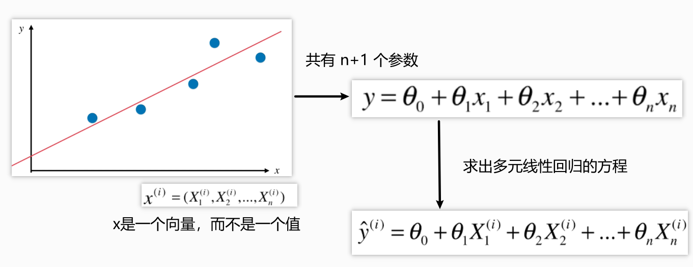

目标是相同的


将回归方程转化为两个向量相乘

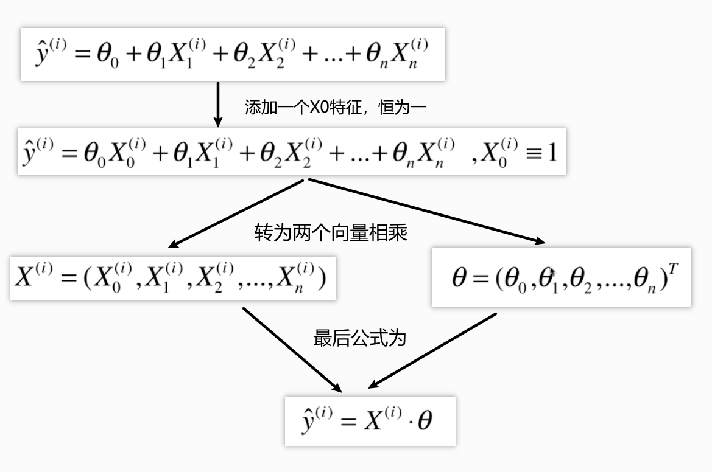

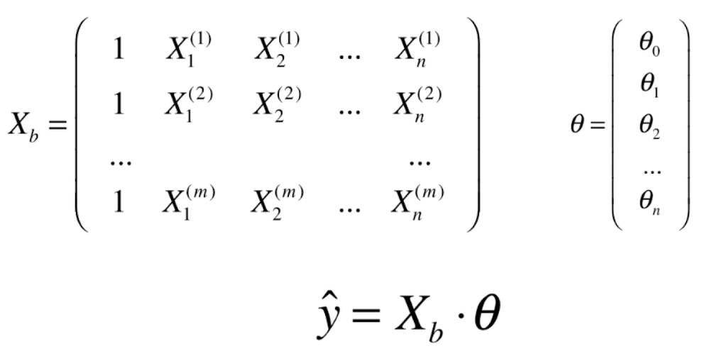

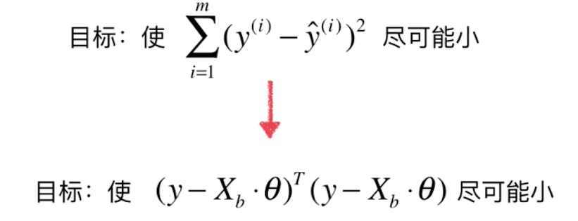

继续转化

多元线性回归的正规方程解

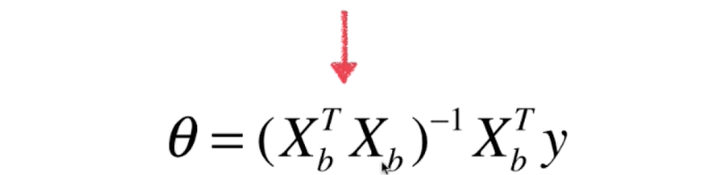

但时间复杂度较高：O(n^3)  (优化后O(n^2.4))

优点：不需要对数据做归一化处理

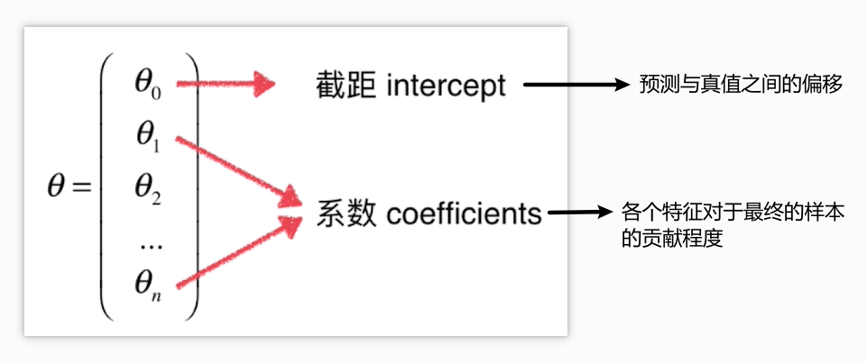

```python
# θ系数向量  类似如下
# 正负的相对大小代表了相关性的特征  保证了数据结果的可解释性
array([ -1.05574295e-01,   3.52748549e-02,  -4.35179251e-02,
         4.55405227e-01,  -1.24268073e+01,   3.75411229e+00,
        -2.36116881e-02,  -1.21088069e+00,   2.50740082e-01,
        -1.37702943e-02,  -8.38888137e-01,   7.93577159e-03,
        -3.50952134e-01])
```

### 线性回归的方法在 `scilit-learn` 模块中封装

## 总结

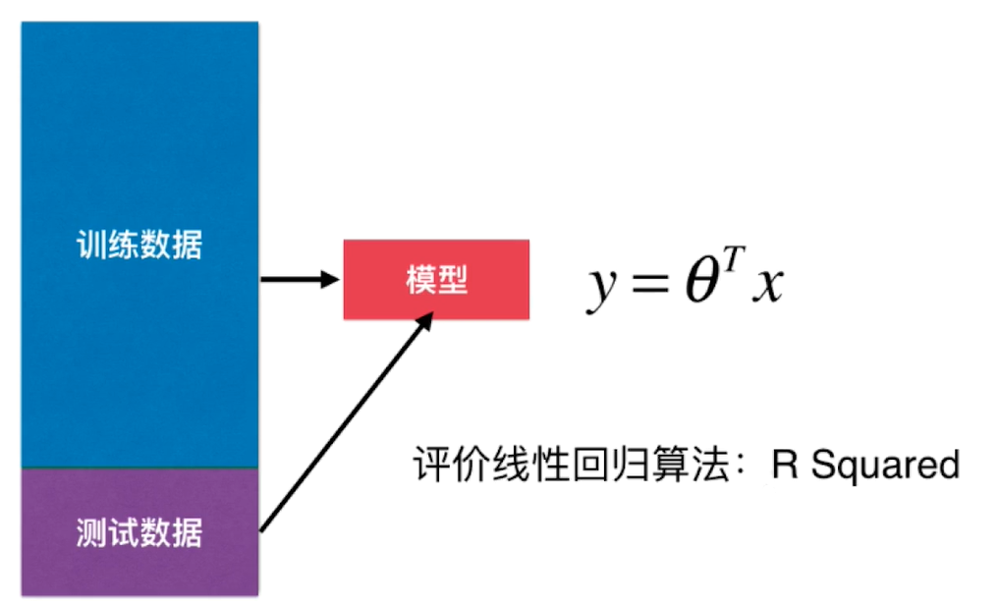

- 典型的参数学习
- 对比KNN： 非参数学习
- 只能解决回归问题
  - 虽然很多分类方法中，线性回归是基础（如逻辑回归）
  - 对比KNN: 既可以解决分类问题，又可以回归问题
- 前提是：数据之间具有线性关系（假设）
- 对比KNN，对数据没有假设

多元线性回归的正规方程解

