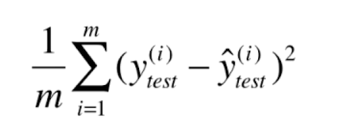

# 线性回归法

**Linear Regression**

*   解决回归问题

*   思想简单，实现容易

*   许多强大的非线性模型的基础

*   结果具有很好的可解释性

*   蕴含机器学习中的很多重要思想

    

求出了最佳拟合的直线方程后，要使实际值y(i) 与 预测值y`(i)  差距尽量小

用（y(i) - y`(i))^2  表示两者的距离（处处可导）

也就是使所有样本的▲y 最小

-   **通过分析问题，确定问题是损失函数或者是效用函数**

-   **通过最优它，获得机器学习的模型**

通过参数去优化函数，进而优化模型

## 向量化运算

## 算法的评测

上面我们求出了决定算法准确度的表达式，表示 y_prediction  和  y_fact 之间的差距之和

但有一个明显的缺陷是： 误差与数据集的数量m 是相关的

需要将这个因素消除掉

### 均方误差 MSE

均方误差会将较大的误差值放大（平方的缘故）

所以使均方误差越小，最大的误差也就越小

将其除以m    称为 均方误差 MSE

### 均方根误差RMSE

然后加上根号，让量纲统一    

### 平均绝对误差

## 评价回归算法 R Square

对于不同标签的数据集，采用上面的MSE或是RSE，都无法反映不同标签之间的误差大小

而回归算法 R Square 更好的解决了这个问题

