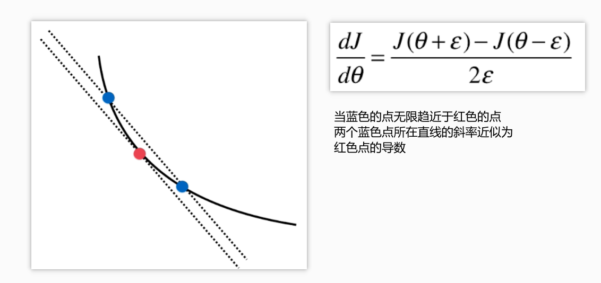

# 梯度下降法

>   代表方向，对应J增大的最快方向

* 不是一个机器学习算法
* 是一种基于搜索的最优化方法
* 作用：最小化一个损失函数
* 梯度上升法：最大化一个效用函数

曲线上的每一个点的导数代表方向，对应J增大的方向

横纵坐标的变化值与移动步长的乘积为 移动的距离

## **ŋ**步长

* 称为学习率（与**ŋ**大小成反比）
* 取值影响获得最优解的速度
* 取值不合适，甚至得不到最优解
* 是梯度下降法的一个超参数

太短导致每一次移动距离过小，时间消耗大

太长导致可能取不到最优解

问题： 并不是所有函数都有唯一的极值点

解决：

* 多次运行，随机化初始点
* 梯度下降法的初始点也是一个超参数

## 梯度下降法

### 从二维到多维

从原来的一个参数，变为一个向量（含有很多参数）

例如：在线性回归中

目标：使实际的y值与预测的y的差值最小

推导过程：

若想让差值与样本个数无关 需要再除以样本个数m

即，最后表达式为

### 在线性回归模型中的应用

* 在KNN算法中的应用

* 在线性回归中的应用

### 线性回归中梯度下降法的向量化

完成向量化

又称批量梯度下降法

### 梯度下降法与数据归一化

使用梯度下降法前，最好进行数据归一化

### 梯度下降法的优点

减少了时间损耗

## 随机梯度下降法

* 批量梯度下降法对于数据的处理计算过于频繁
* 跳出局部最优解
* 更快的运行速度
* 机器学习很多算法都要使用随机的特点：随机搜索，随机森林

随机梯度下降法

不对所有样本进行计算，而是对其中随机的一个样本进行及计算

对于梯度下降法的循环次数 i  与 学习率ŋ之间的函数关系

模拟退火的方法

## 梯度的调试

## 总结

*   批量梯度下降法
*   随机梯度下降法
*   小批量梯度下降法

