# matplotlib

通常的，横轴为特征，纵轴为对应的取值

```python
import matplotlib as mpl
import matplotlib.pyplot as plt
```

## 利用库绘制sin图像

```python
x = numpy.linspace(0, 10, 100)
y = numpy.sin(x)
# 绘制图像
plt.plot(x, y)
```

返回的是

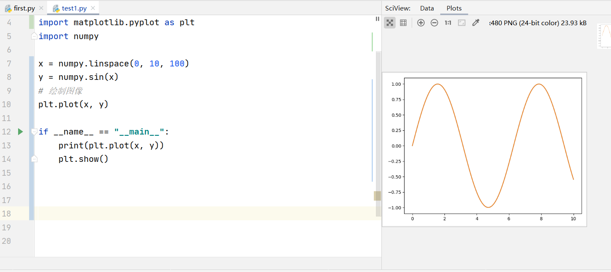


## 在一张图上的多个曲线

```python
cosy = numpy.cos(x)
cosy.shape
siny = y.copy()
plt.plot(x, siny)
plt.plot(x, cosy)
plt.show()
```

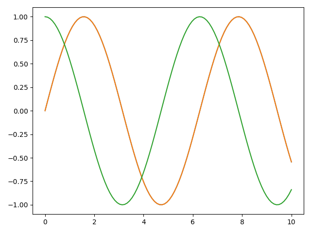


## 可以指定曲线颜色

```python
plt.plot(x, siny)
plt.plot(x, cosy, color="red")
plt.show()
```

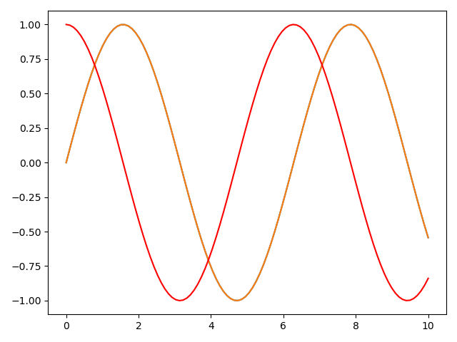


## 指定线条样式

```python
plt.plot(x, siny)
plt.plot(x, cosy, color="red", linestyle="--")
plt.show()
```

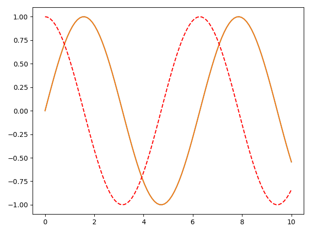


## 指定图像范围

### 横轴

```python
plt.plot(x, siny)
plt.plot(x, cosy, color="red", linestyle="--")
plt.xlim(-5, 15)
plt.show()
```

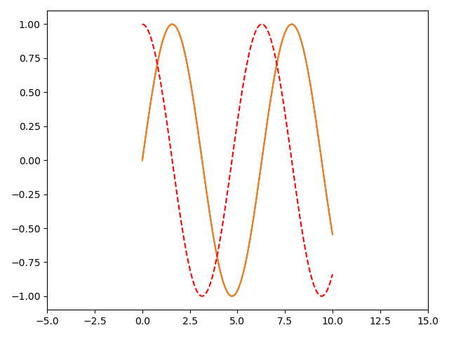

### 纵轴

```python
plt.plot(x, siny)
plt.plot(x, cosy, color="red", linestyle="--")
plt.xlim(-5, 15)
plt.ylim(0, 1.5)
plt.show()
```

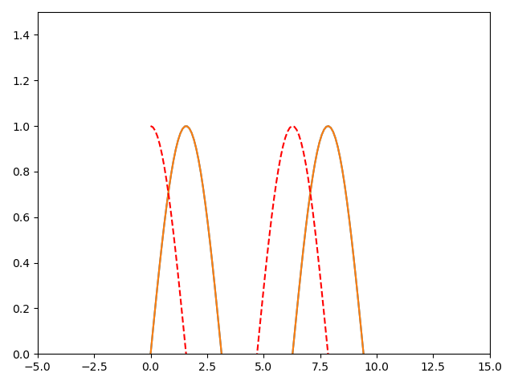


## 通过 `axis()` 同时对横纵轴进行限制

```python
plt.axis([x.start, x.end, y.start, y.end])
plt.axis([-1, 11, -2, 2])
```

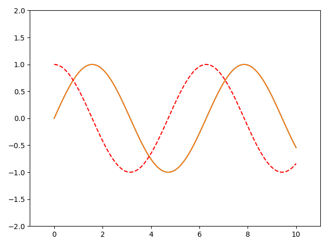


## `.xlabel() .ylabel()`  对横纵轴表达含义做解释

```python
plt.xlabel("x axis")
plt.ylabel("y axis")
```

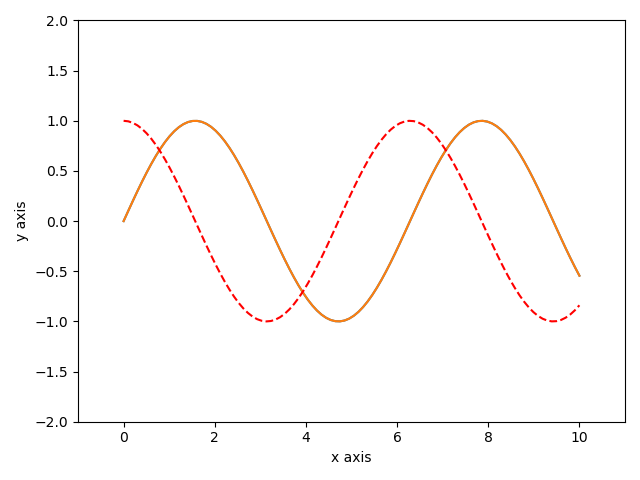


## 给曲线标明注释

```python
plt.plot(x, siny, label="sin(x)")
plt.plot(x, cosy, color="red", linestyle="--", label="cos(x)")
plt.legend()  # 让注释显示
```

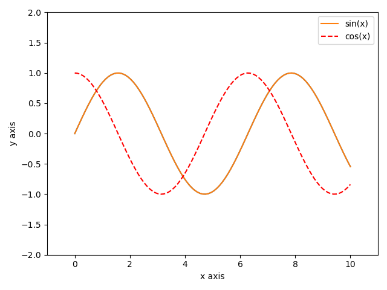


## 添加标题

```python
plt.title("Welcome to the My World!")
```

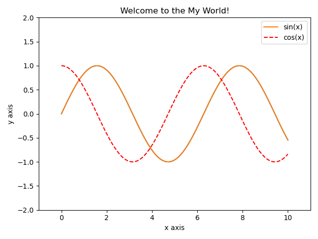


## 绘制散点图

通常来讲，散点图的两个轴都表示特征

```python
plt.scatter(x, siny)
plt.show()
```

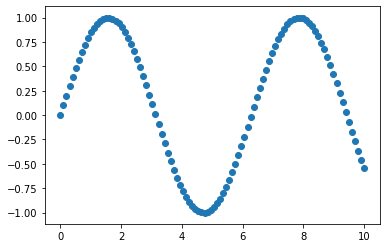


### 生成符合正态分布的散点图

```python
x = numpy.random.normal(0, 1, 100)
y = numpy.random.normal(0, 1, 100)

plt.scatter(x, y)
plt.show()
```

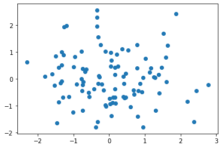

当点的数量超级多时，正态分布的趋势相当明显

```python
x = numpy.random.normal(0, 1, 10000)
y = numpy.random.normal(0, 1, 10000)

plt.scatter(x, y)
plt.show()
```

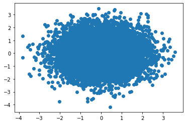

设置点的不透明度为 0.5

```python
x = numpy.random.normal(0, 1, 10000)
y = numpy.random.normal(0, 1, 10000)

plt.scatter(x, y, alpha=0.5)
plt.show()
```

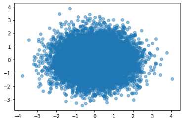

透明度为 0.1 时

```python
plt.scatter(x, y, alpha=0.1)
```

