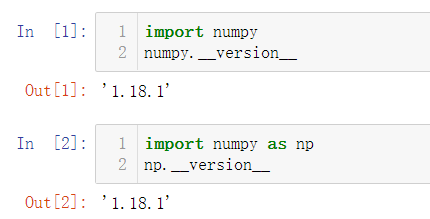

## 查看对应版本号




## `numpy.array` 的方法

创建 `numpy` 类型的数组

```python
# 数组元素必须为同一类型   可以进行相近类型转化
numpyArray = numpy.array([i for i in range(10)])
# 查看存储数据类型
numpyArray.dtype
# int32
```

### `numpy.zeros()` 方法

```python
# 创建一个都为零的数组
numpyArray1 = numpy.zeros(10)
numpyArray1.dtype
# [0. 0. 0. 0. 0. 0. 0. 0. 0. 0.]
# float64

# 创建一个都为零的二维数组
numpyArray2 = numpy.zeros((3,4))
# [[0. 0. 0. 0.]
#  [0. 0. 0. 0.]
#  [0. 0. 0. 0.]]

# 具体
numpyArray3 = numpy.zeros(shape=(3,4), dtype=int)
# [[0 0 0 0]
#  [0 0 0 0]
#  [0 0 0 0]]

# 创建都为1 的数组  浮点型
numpyArray4 = numpy.ones(10)
# [1. 1. 1. 1. 1. 1. 1. 1. 1. 1.]

numpyArray5 = numpy.ones((3, 5))
# [[1. 1. 1. 1. 1.]
#  [1. 1. 1. 1. 1.]
#  [1. 1. 1. 1. 1.]]

# 指定元素  整型
numpyArray6 = numpy.full((3, 4), 11)
# 或者是
numpyArray6 = numpy.full(shape=(3, 4), fill_value=11)
# [[11 11 11 11]
#  [11 11 11 11]
#  [11 11 11 11]]
```


### `arange` 方法

与 range 方法相同

```python
numpyArray7 = numpy.arange(0, 20, 1)
# [ 0  1  2  3  4  5  6  7  8  9 10 11 12 13 14 15 16 17 18 19]
```

不同的是，`arange` 中的步长(第三个参数)可以为浮点数

```python
numpyArray7 = numpy.arange(0, 3, 0.2)
# [0.  0.2 0.4 0.6 0.8 1.  1.2 1.4 1.6 1.8 2.  2.2 2.4 2.6 2.8]
```


### `linspace`  方法

与range不同的是，数组包含结束元素，第三个参数代表数组有几个数，形成等差数组

```python
numpyArray8 = numpy.linspace(0, 20, 5)
# [ 0.  5. 10. 15. 20.]
```


### `random`  方法

生成随机数

```python
numpyArray9 = numpy.random.randint(0, 10)
# 9
# 生成10个随机数, 在0到10之间(前闭后开)
numpyArray9 = numpy.random.randint(0, 10, 10)
numpyArray9 = numpy.random.randint(0, 10, size=10)
# 生成随机矩阵
numpyArray9 = numpy.random.randint(0, 10, size=(3,5))
```


随机种子的使用，相当于给一种随机性加上 id

```python
numpy.random.seed(10)
numpyArray9 = numpy.random.randint(0, 10, 5)
numpy.random.seed(10)
numpyArray10 = numpy.random.randint(0, 10, 5)
# [9 4 0 1 9]
# [9 4 0 1 9]
```


符合正态分布的浮点数

```python
# 默认值为 符合均值为0 方差为1 的正态分布
numpyArray11 = numpy.random.normal()
# 0.28154955449022134

# 符合均值为10 方差为100 的正态分布
numpyArray12 = numpy.random.normal(10, 100)
# 118.53699455631376

# 符合均值为10 方差为100 的正态分布 的矩阵
numpyArray12 = numpy.random.normal(10, 100, (3, 4))
# [[  -0.41346028  -51.32942027  -53.31777518  -97.55511239]
#  [ -69.96572391  -68.84703358 -181.33005977   31.20567573]
#  [-154.90949209   15.78530079  -85.66367579  313.0670341 ]]
```

