# 机器学习

## 概念

什么是机器学习

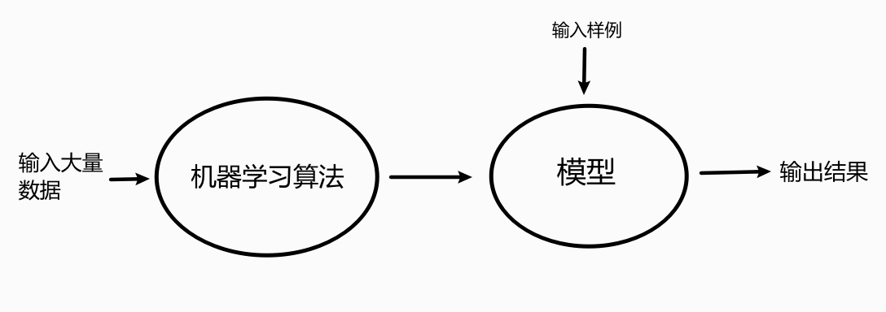

输入大量数据，通过算法产生模型(f(x))  输入实际样例，根据模型输出结果

**机器学习的原理**

下面以监督学习为例，给大家讲解一下机器学习的实现原理。

假如我们正在教小朋友识字（一、二、三）。我们首先会拿出3张卡片，然后便让小朋友看卡片，一边说“一条横线的是一、两条横线的是二、三条横线的是三”

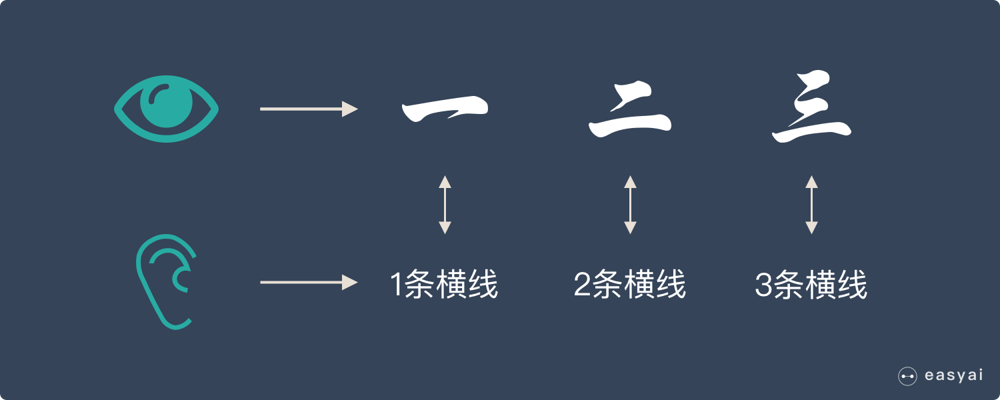

当重复的次数足够多时，小朋友就学会了一个新技能——认识汉字：一、二、三。

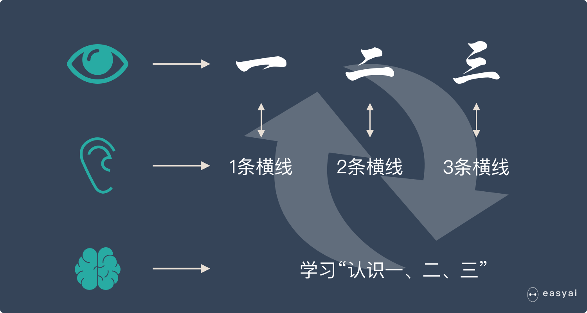

我们用上面人类的学习过程来类比机器学习。机器学习跟上面提到的人类学习过程很相似。

-   上面提到的认字的卡片在机器学习中叫——训练集
-   上面提到的“一条横线，两条横线”这种区分不同汉字的属性叫——特征
-   小朋友不断学习的过程叫——建模
-   学会了识字后总结出来的规律叫——模型

**通过训练集，不断识别特征，不断建模，最后形成有效的模型，这个过程就叫“机器学习”！**

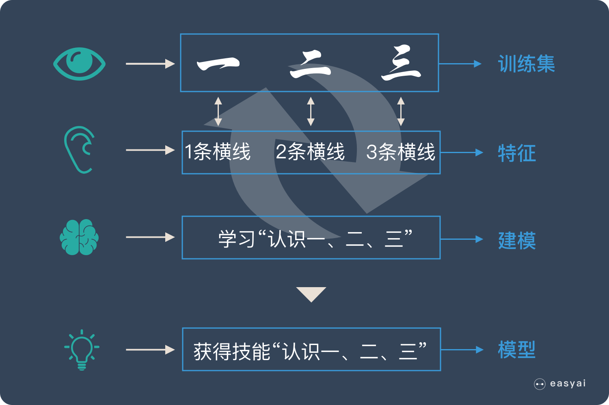

## 机器学习的步骤

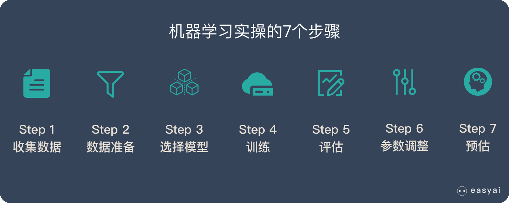

假设我们的任务是通过酒精度和颜色来区分红酒和啤酒，下面详细介绍一下机器学习中每一个步骤是如何工作的。

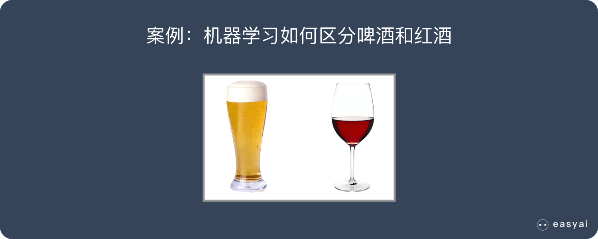案例目标：区分红酒和啤酒

 

**步骤1：收集数据**

我们在超市买来一堆不同种类的啤酒和红酒，然后再买来测量颜色的光谱仪和用于测量酒精度的设备。

这个时候，我们把买来的所有酒都标记出他的颜色和酒精度，会形成下面这张表格。

| 颜色 | 酒精度 | 种类 |
| :--- | :----- | :--- |
| 610  | 5      | 啤酒 |
| 599  | 13     | 红酒 |
| 693  | 14     | 红酒 |
| …    | …      | …    |

**这一步非常重要，因为数据的数量和质量直接决定了预测模型的好坏。**

 

**步骤2：数据准备**

在这个例子中，我们的数据是很工整的，但是在实际情况中，我们收集到的数据会有很多问题，所以会涉及到数据清洗等工作。

当数据本身没有什么问题后，我们将数据分成3个部分：训练集（60%）、验证集（20%）、测试集（20%），用于后面的验证和评估工作。

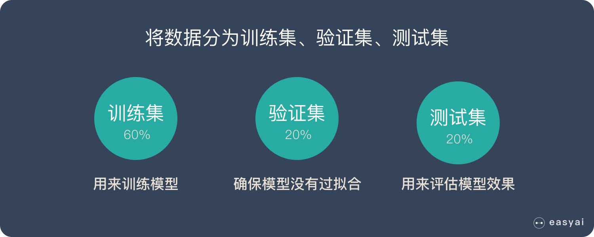数据要分为3个部分：训练集、验证集、测试集

**步骤3：选择一个模型**

研究人员和数据科学家多年来创造了许多模型。有些非常适合图像数据，有些非常适合于序列（如文本或音乐），有些用于数字数据，有些用于基于文本的数据。

在我们的例子中，由于我们只有2个特征，颜色和酒精度，我们可以使用一个小的线性模型，这是一个相当简单的模型。

**步骤4：训练**

大部分人都认为这个是最重要的部分，其实并非如此~ 数据数量和质量、还有模型的选择比训练本身重要更多（训练知识台上的3分钟，更重要的是台下的10年功）。

这个过程就不需要人来参与的，机器独立就可以完成，整个过程就好像是在做算术题。因为机器学习的本质就是**将问题转化为数学问题，然后解答数学题的过程**。

**步骤5：评估**

一旦训练完成，就可以评估模型是否有用。这是我们之前预留的验证集和测试集发挥作用的地方。评估的指标主要有 准确率、召回率、F值。

这个过程可以让我们看到模型如何对尚未看到的数是如何做预测的。这意味着代表模型在现实世界中的表现。

**步骤6：参数调整**

完成评估后，您可能希望了解是否可以以任何方式进一步改进训练。我们可以通过调整参数来做到这一点。当我们进行训练时，我们隐含地假设了一些参数，我们可以通过认为的调整这些参数让模型表现的更出色。

**步骤7：预测**

我们上面的6个步骤都是为了这一步来服务的。这也是机器学习的价值。这个时候，当我们买来一瓶新的酒，只要告诉机器他的颜色和酒精度，他就会告诉你，这时啤酒还是红酒了。


## 数据的概念

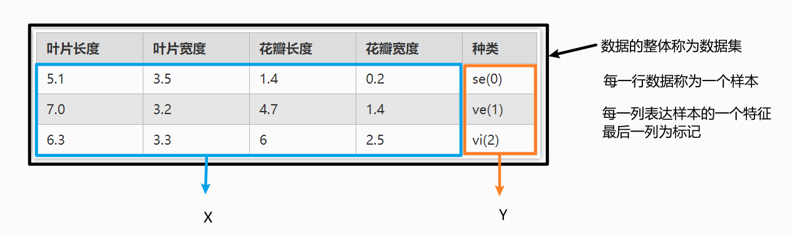

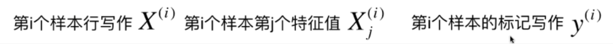

每一行成为一个特征向量 X^(i)   通过以列向量的形式居多

### 特征空间

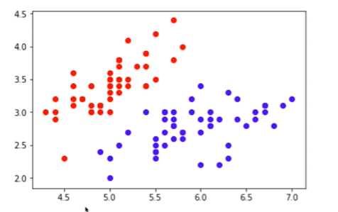

上图将数据的两个特征在一个二维坐标空间中表示

表示多个特征时，也是一样的

而分类任务本质就是在特征空间的划分

## 机器学习的基本任务

### 分类任务

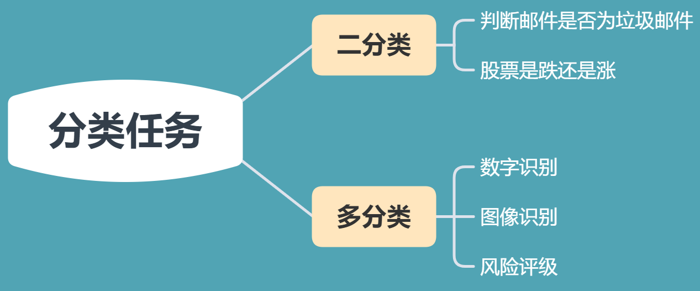

### 回归任务

结果是一个连续数据的值，不是类别

回归任务与分类任务之间可以存在互相转化

## 机器学习方法的分类

### 监督学习

>   给机器的训练数据拥有“标记”   有X 有Y

### 非监督学习

>   给机器的训练数据无标记    聚类分析

* 可以对数据进行降维处理，便于数据可视化

* 可以筛选去除某些无关的特征

* 或者进行特征压缩，多个特征耦合度极高，可以将其合并，将特征高维的向量转为低维的特征向量

* 可以进行异常检测

### 半监督学习

>   训练数据一部分有标记，一部分无标记
> 
>   这样的数据集更常见

通常都先使用无监督学习手段对数据做处理，之后使用监督学习手段做模型的训练和预测

### 增强学习

>   根据周围环境的情况，采取行动，根据采取行动的结果，学习行动方式

无人驾驶，机器人

监督学习和半监督学习是基础

## 其他分类

### 批量学习

* 优点：简单

* 问题：如何适应的环境变化？
  
    定时重新批量学习

* 缺点：每次重新批量学习，运算量巨大，在某些环境变化非常快的情况下，甚至是不可能的

### 在线学习

通过输出结果与实际结果比较，将实际结果作为数据集进行学习算法分析，改进模型

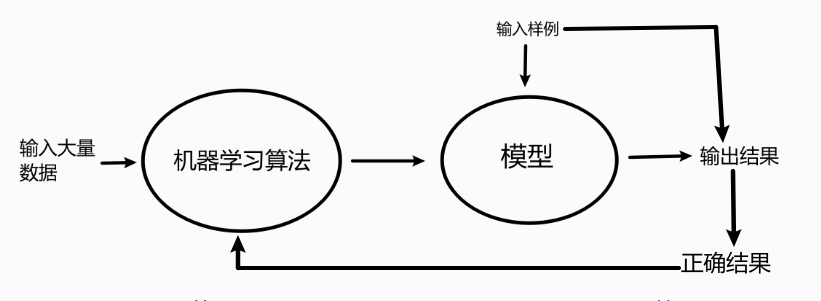

* 优点：及时反映新的环境变化

* 问题：新的数据带来不好的变化
  
    解决方案：需要加强对数据进行监控

* 也适用于数据量巨大，完全无法批量学习的环境

## 参数学习

>   学到了参数，就不再需要原有的数据集

## 非参数学习

* 不对模型进行过多假设
* 非参数不等于没参数

## 数据的思考

* 数据即算法？

# 环境搭建

## 语言

Python3

## Anaconda 集成开发环境

 [官网下载地址](https://www.anaconda.com/products/individual)

点击

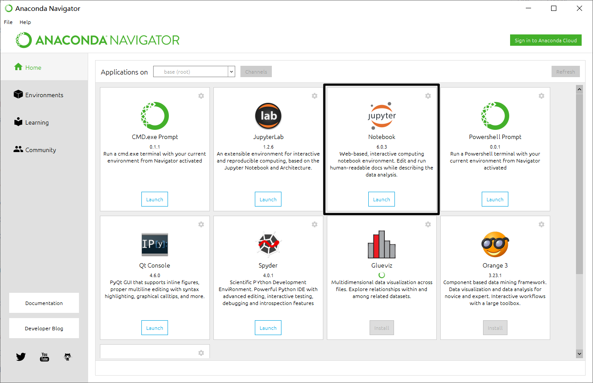

点击进入

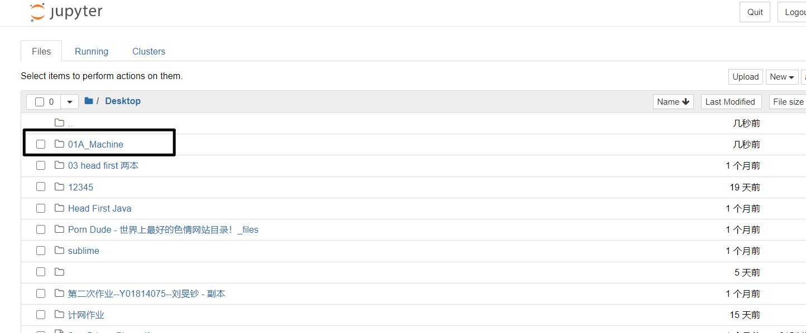

创建新的项目环境

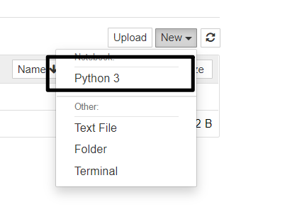

在pycharm创建项目时，要选择 对应版本的python版本

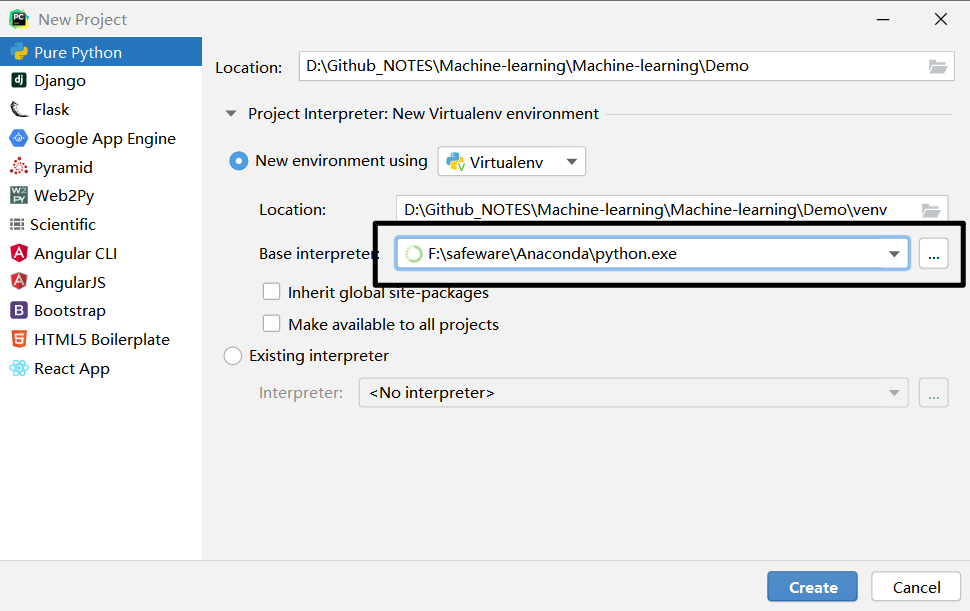

按照所用到的包

```python
import numpy
import matplotlib
import sklearn
import pandas
```

## Notebook的使用

查询快捷键

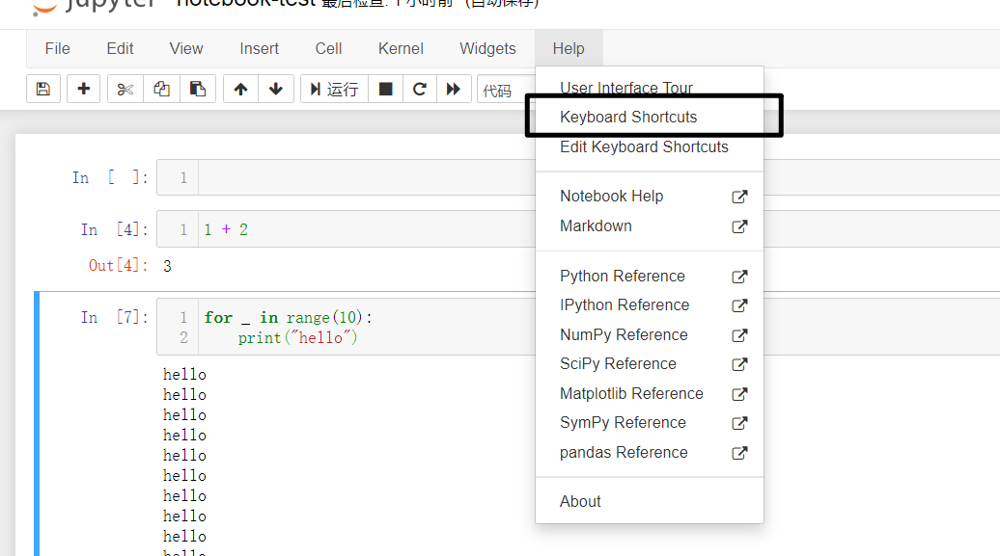

### 高级命令

先将项目文件放到 notebook-test目录下

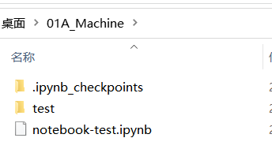

#### `%run` 运行命令

通过 `%run test/test.py` 命令将test.py脚本加载进入了notebook中

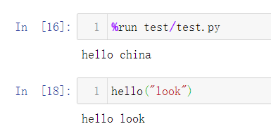

#### `%timeit` 测试运行时间

`%timeit L = [i**2 for i in range(1000)]`  测试一行代码的运行时间

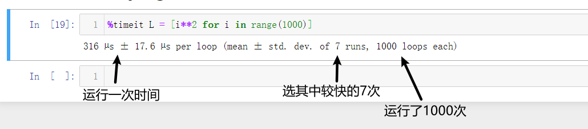

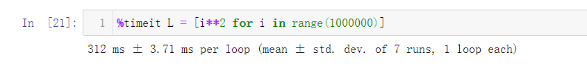

```
%%timeit 
L = []
for n in range(1000):
    L.append(n ** 2)
```

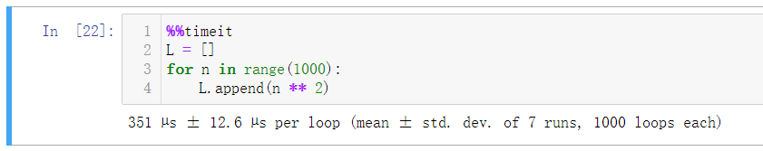

`%time` 只运行一次

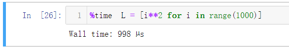

使用此方法进行时间度量，缺点是：在遇到运行时间本就不稳定的程序时，测试时间可能会有很大偏差

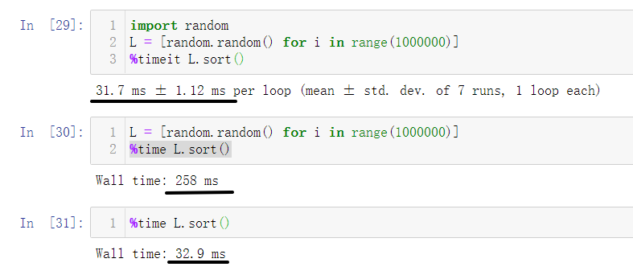

`%lsmagic` 查看魔法命令目录

`%run?` 查看魔法命令 run 的文档