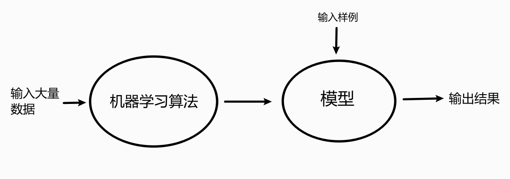
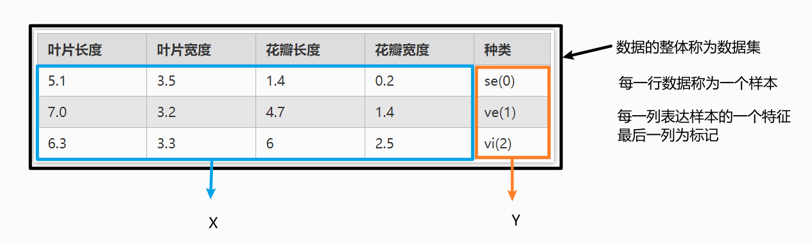
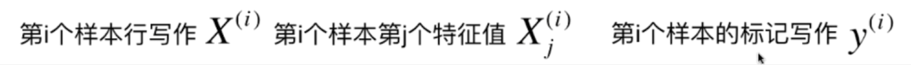
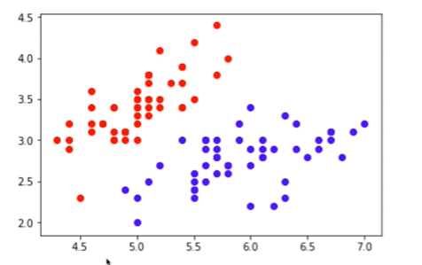
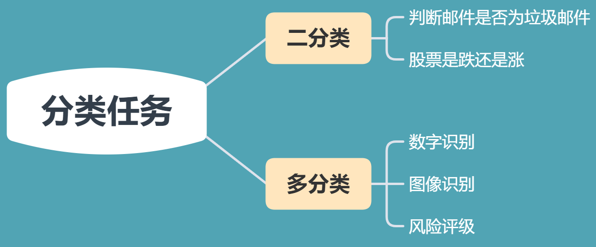
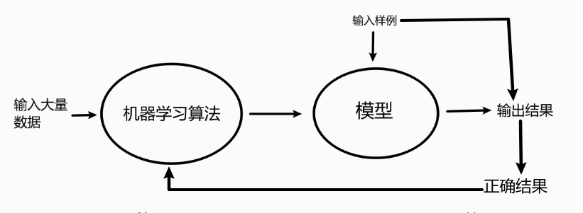

## 机器学习

什么是机器学习

输入大量数据，通过算法产生模型(f(x))  输入实际样例，根据模型输出结果

## 数据的概念

每一行成为一个特征向量 X^(i)   通过以列向量的形式居多

### 特征空间

上图将数据的两个特征在一个二维坐标空间中表示

表示多个特征时，也是一样的

而分类任务本质就是在特征空间的划分

## 机器学习的基本任务

### 

### 分类任务

### 回归任务

结果是一个连续数据的值，不是类别

回归任务与分类任务之间可以存在互相转化

## 机器学习方法的分类

### 监督学习

>   给机器的训练数据拥有“标记”   有X 有Y

### 非监督学习

>   给机器的训练数据无标记    聚类分析

* 可以对数据进行降维处理，便于数据可视化

* 可以筛选去除某些无关的特征

* 或者进行特征压缩，多个特征耦合度极高，可以将其合并，将特征高维的向量转为低维的特征向量

* 可以进行异常检测

### 半监督学习

>   训练数据一部分有标记，一部分无标记
> 
>   这样的数据集更常见

通常都先使用无监督学习手段对数据做处理，之后使用监督学习手段做模型的训练和预测

### 增强学习

>   根据周围环境的情况，采取行动，根据采取行动的结果，学习行动方式

无人驾驶，机器人

监督学习和半监督学习是基础

## 其他分类

### 批量学习

* 优点：简单

* 问题：如何适应的环境变化？
  
  定时重新批量学习

* 缺点：每次重新批量学习，运算量巨大，在某些环境变化非常快的情况下，甚至是不可能的

### 在线学习

通过输出结果与实际结果比较，将实际结果作为数据集进行学习算法分析，改进模型

* 优点：及时反映新的环境变化

* 问题：新的数据带来不好的变化
  
  解决方案：需要加强对数据进行监控

* 也适用于数据量巨大，完全无法批量学习的环境

## 参数学习

>   学到了参数，就不再需要原有的数据集

## 非参数学习

* 不对模型进行过多假设
* 非参数不等于没参数

## 数据的思考

* 数据即算法？
