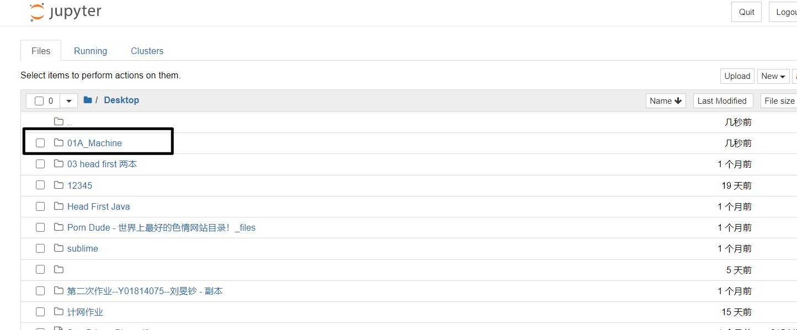
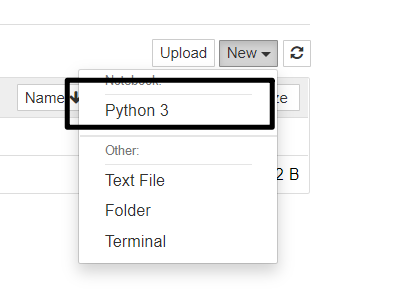
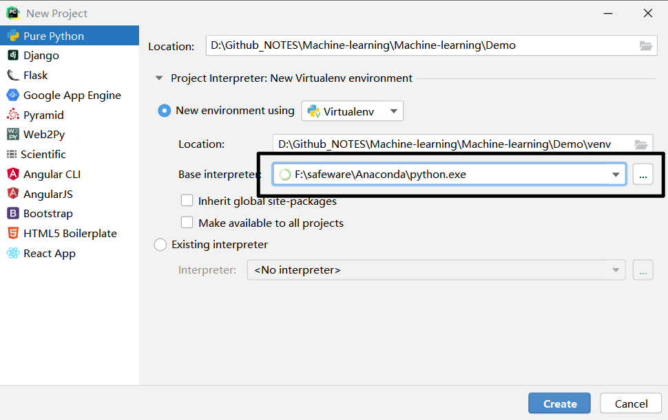
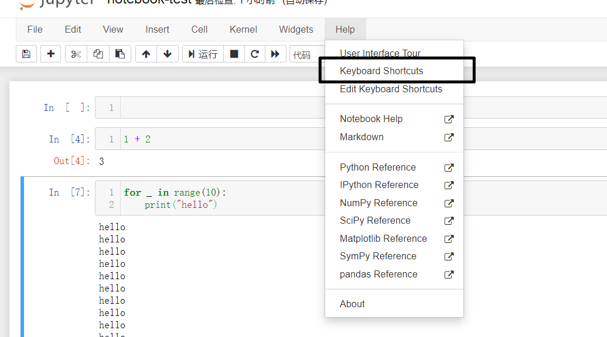
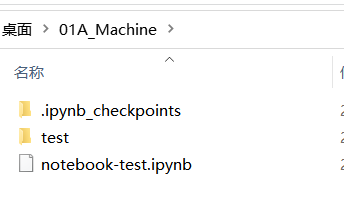
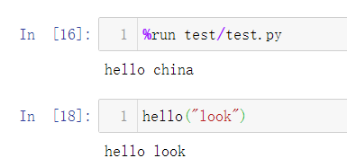
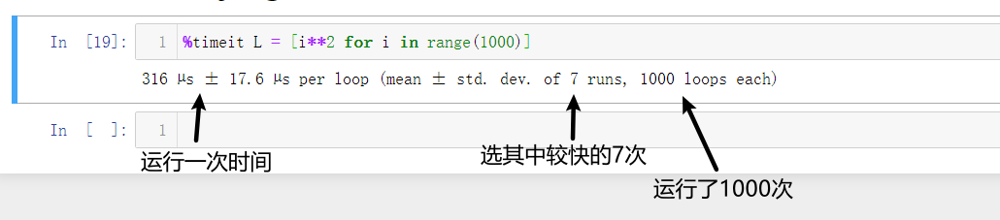
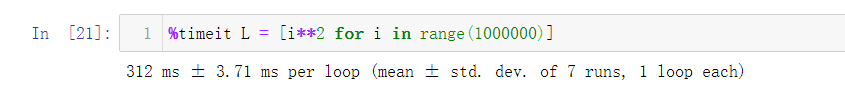
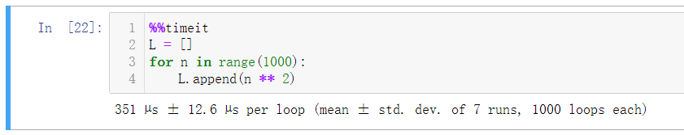
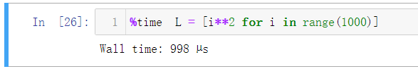

语言

Python3

Anaconda 集成开发环境 

 [官网下载地址](https://www.anaconda.com/products/individual)

点击


点击进入



创建新的项目环境




在pycharm创建项目时，要选择 对应版本的python版本



按照所用到的包

```python
import numpy
import matplotlib
import sklearn
import pandas
```


## Notebook的使用

查询快捷键




### 高级命令

先将项目文件放到 notebook-test目录下



#### `%run` 运行命令

通过 `%run test/test.py` 命令将test.py脚本加载进入了notebook中




#### `%timeit` 测试运行时间


`%timeit L = [i**2 for i in range(1000)]`  测试一行代码的运行时间






```
%%timeit 
L = []
for n in range(1000):
    L.append(n ** 2)
```




`%time` 只运行一次




使用此方法进行时间度量，缺点是：在遇到运行时间本就不稳定的程序时，测试时间可能会有很大偏差


`%lsmagic` 查看魔法命令目录

`%run?` 查看魔法命令 run 的文档