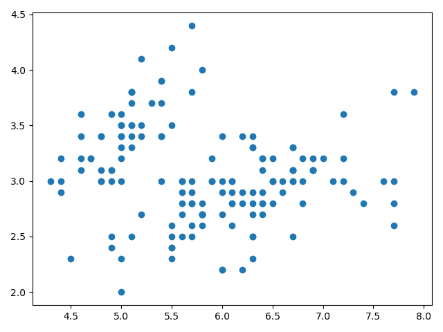
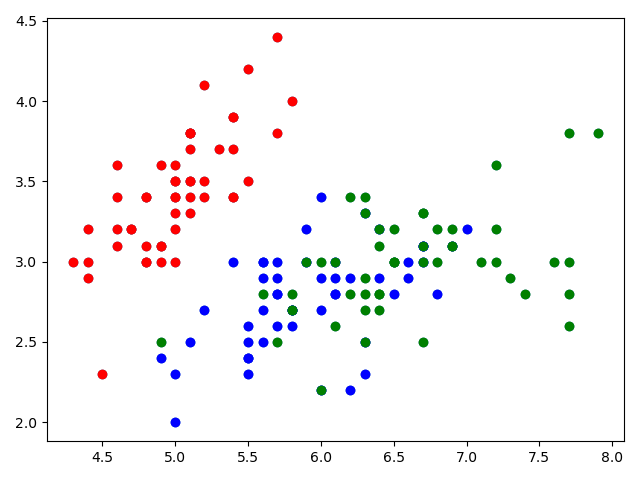
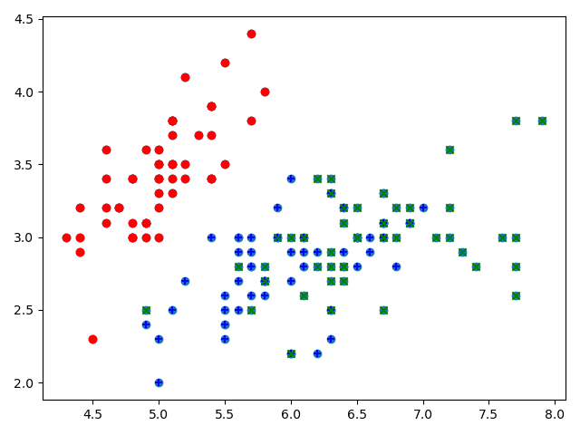
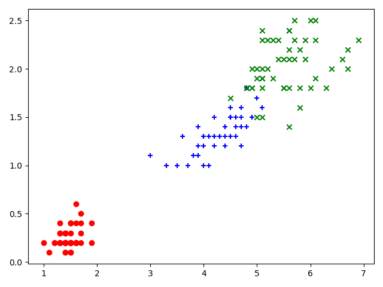

# 读取数据和简单的数据探索

```python
import matplotlib as mpl
import matplotlib.pyplot as plt
import numpy as np
from sklearn import datasets
```

先从库中调用实验数据集

```python
iris = datasets.load_iris()
# 打印数据集的特征
print(iris.keys())
# dict_keys(['data', 'target', 'frame', 'target_names', 'DESCR', 'feature_names', 'filename'])
# 查看数据集的文档
print(iris.DESCR)
# 查看数据集具体数据
print(iris.data)
# 查看数据集的维度
print(iris.data.shape)
# 查看特性名称
print(iris.feature_names)
# 查看数据集每一行对应的类别（标签） 返回一个一维数组
print(iris.target)
# 查看标签名字
iris.target——names
```

## 操作数据

```python
# 取数据集的前两列
x = iris.data[:, :2]
# 绘制散点图
plt.scatter(x[:,0], x[:,1])
plt.show()
```



用不同颜色标记不同类别

```python
y = iris.target
plt.scatter(x[y==0,0], x[y==0,1], color="red")
plt.scatter(x[y==1,0], x[y==1,1], color="blue")
plt.scatter(x[y==2,0], x[y==2,1], color="green")
plt.show()
```



改变点的形状来区分类别

```python
y = iris.target
plt.scatter(x[y==0,0], x[y==0,1], color="red", marker="o")
plt.scatter(x[y==1,0], x[y==1,1], color="blue", marker="+")
plt.scatter(x[y==2,0], x[y==2,1], color="green", marker="x")
plt.show()
```



```python
x = iris.data[:,2:]
plt.scatter(x[y==0,0], x[y==0,1], color="red", marker="o")
plt.scatter(x[y==1,0], x[y==1,1], color="blue", marker="+")
plt.scatter(x[y==2,0], x[y==2,1], color="green", marker="x")
plt.show()
```



设计算法区分三种类别是机器学习的任务